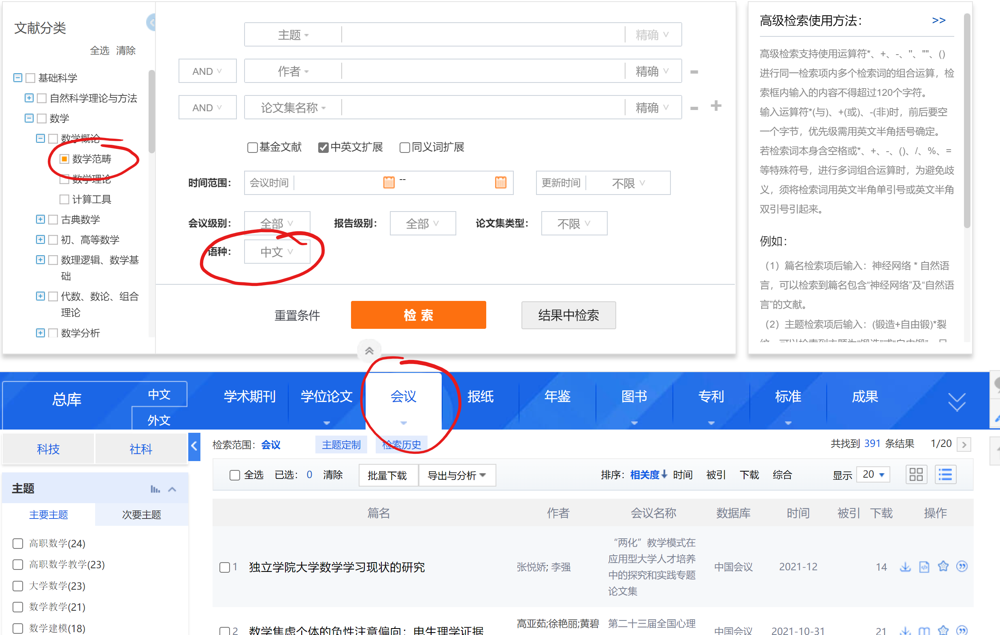

## 前言

这是本人第一次上传项目，如果存在表述不正确、不详细、对项目有疑问或希望共同探讨进步，欢迎联系本人email：a1332915560@hotmail.com。

## 功能

爬取知网中文文献信息，包括文献标题、作者、摘要、会议/期刊、关键字等。具体信息如下：

\# 学术期刊

qkInfoCSS = {

  'qk_name': r'div.top-tip > span > a',                              # 所属期刊名称及时间(可能没有时间)

  'qk_netTime': r'div.head-time > span',                         # 文献网络首发时间

  'qk_title': r'div.wx-tit > h1',                                             # 文献标题

  'qk_auther': r'h3#authorpart.author > span',            # 作者

  'qk_institution': r'a.author',                                           # 作者所属机构

  'qk_abstract': r'span#ChDivSummary',                       # 摘要

  'qk_keys': r'p.keywords > a'                                          # 关键字

}

\# 会议

hyInfoCSS = {

  'hy_title': r'div.wx-tit > h1',                                           # 文献标题

  'hy_auther': r'h3#authorpart.author > span',          # 作者

  'hy_institution': r'a.author',                                         # 作者所属机构

  'hy_abstract': r'span#ChDivSummary',                    # 摘要

  'hy_keys': r'p.keywords > a'                                       # 关键字

}

hy_info = r'div.row > span'                                          # 会议信息（名称、时间、地点等）

## 爬取内容

知网高级检索中的会议和学术期刊两大类，会议限制条件为中文，学术期刊限制条件为SCI，每个大类都爬取文献分类中的所有类别，如下图。


以会议为例：

首先在高级检索界面点击 ‘会议’ ，语种选择 ‘中文’ ，在文献分类中选择一个不可细分的分类（就像树中的叶子节点），点击检索，处理检索结果。如下图。



## 环境要求

### 操作系统

Linux 或 windows

### python

python3

### chrome

chrome浏览器，自行下载安装

### webdriver

webdriver，自行下载安装，需要与chrome版本对应，安装后需要加入PATH（环境变量）。

### mongoDB

mongoDB，自行下载安装，可以手动运行或者设为系统服务

### python库

selenium、pymongo

selenium是浏览器自动化测试工具，可以模拟手动打开浏览器完成各种动作，需要有webdriver来驱动浏览器，使用selenium的原因是，对于动态渲染的网页，很难获取它的真实网址，request库就很难适用，即使获取到了真实网址也不一定能够实现批量的爬取操作，而selenium则可以模拟浏览器的各种动作，就像真正使用浏览器浏览网页一样，这样对于动态网页来说就可以不用获取真实网址，直接通过浏览器渲染即可。

pymongo是mongoDB提供的python工具包，可以通过python代码操作数据库

## 目录


```
.
├── log                      日志文件(utf-8编码)
├── pic                      readme.md图片
├── src                      源码
│   ├── all.py                 入口1
│   ├── cnkiManager.py         知网爬虫类
│   ├── commontools.py         通用工具
│   ├── crawler_log.py         log
│   ├── mongoDBManager.py      mongoDB管理
│   ├── runThreads.py          多线程管理
│   ├── single.py              入口2
│   └── test.py
├── .gitignore
├── readme.md
├── runAll.sh                Linux入口1(因适配windows而弃用)
└── runSingle.sh             Linux入口2(同上)
```

## 入口

### 入口1 all.py

爬取所有类别的文献，命令行参数采取直接在all.py后跟参数值的形式

#### 举例

python all.py 2

python ---- python

all.py ------- 运行的文件

2 ------------- 线程数，表示同时允许有两个线程进行文献爬取，每个线程爬取1个分类，注意，此处的分类说的是文献分类。假设大类有会议、学术期刊等等m个，文献分类有基础科学、工程科技Ⅰ辑等等n个，那么此处说的分类一共有 m * n 个。截至本项目上传，m = 2, n = 10，共有20个分类，分类列表为:

[

0.qk.基础科学,

1.qk.工程科技Ⅰ辑,

2.qk.工程科技Ⅱ辑,

3.qk.农业科技,

4.qk.医药卫生科技,

5.qk.哲学与人文科学,

6.qk.社会科学Ⅰ辑,

7.qk.社会科学Ⅱ辑,

8.qk.信息科技,

9.qk.经济与管理科学,

10.hy.基础科学,

11.hy.工程科技Ⅰ辑,

12.hy.工程科技Ⅱ辑,

13.hy.农业科技,

14.hy.医药卫生科技,

15.hy.哲学与人文科学,

16.hy.社会科学Ⅰ辑,

17.hy.社会科学Ⅱ辑,

18.hy.信息科技,

19.hy.经济与管理科学

]

### 入口2 single.py

爬取某个或某几个类别的文献，命令行参数采取直接在single.py后跟参数值的形式

#### 举例

 python single.py 2 [3,4] [209,140]

python --------- python

single.py ------- 运行的文件

2 ------------------ 线程数，表示同时允许有两个线程进行文献爬取，每个线程爬取1个分类，注意，此处的分类说的是文献分类。假设大类有会议、学术期刊等等m个，文献分类有基础科学、工程科技Ⅰ辑等等n个，那么此处说的分类一共有 m * n 个。截至本项目上传，m = 2, n = 10，共有20个分类，分类列表为:

[

0.qk.基础科学,

1.qk.工程科技Ⅰ辑,

2.qk.工程科技Ⅱ辑,

3.qk.农业科技,

4.qk.医药卫生科技,

5.qk.哲学与人文科学,

6.qk.社会科学Ⅰ辑,

7.qk.社会科学Ⅱ辑,

8.qk.信息科技,

9.qk.经济与管理科学,

10.hy.基础科学,

11.hy.工程科技Ⅰ辑,

12.hy.工程科技Ⅱ辑,

13.hy.农业科技,

14.hy.医药卫生科技,

15.hy.哲学与人文科学,

16.hy.社会科学Ⅰ辑,

17.hy.社会科学Ⅱ辑,

18.hy.信息科技,

19.hy.经济与管理科学

]

[3,4] ------------- 爬取的类别列表，以编号表示，中间不能有空格。在 m * n 个分类中，假设要爬取学术期刊中的农业科技和医药卫生科技，它们两个属于分类列表中的第3个和第4个（从0开始）

[209,140] ------ 要爬取的类别中小类的开始编号，size和上一个参数的size一致，中间不能有空格。设置这个参数的目的是，程序还有一些bug，需要断点续爬，具体的续爬起始编号请查看log。如第二张图所示，每个文献分类都可以再细分，就像一个多叉树，上述分类列表中每一个分类都是一个根，每一棵树都有若干个叶子节点，209表示从再qk.农业科技这个爬虫线程中，从第209个叶子节点开始爬取（假设前面的209个叶子节点都已经爬取过了），140表示从再qk.医药卫生科技这个爬虫线程中，从第140个叶子节点开始爬取（假设前面的140个叶子节点都已经爬取过了）

## 数据库

### 结构

学术期刊和会议两个大类分别构成两个数据库**qk**和**hy**。

每个数据库中有 n + 1 个collections，[summary, 基础科学, 工程科技Ⅰ辑, ……]

1.summary中存储的是每个文献分类已经爬取的文献的数量，结构如下：

| _id                                  | id   | class       | count |
| ------------------------------------ | ---- | ----------- | ----- |
| ObjectId("62393c4033cb081d9f54b1ca") | 0    | 基础科学    | 15598 |
| ObjectId("62393c4133cb081d9f54b1cc") | 2    | 工程科技Ⅱ辑 | 18368 |
| ……                                   | ……   | ……          | ……    |

注：_id为数据库分配的key，id为文献分类的编号，class为分类名称，count为已爬取数量

2.其余collections存储的是爬取的论文数据


